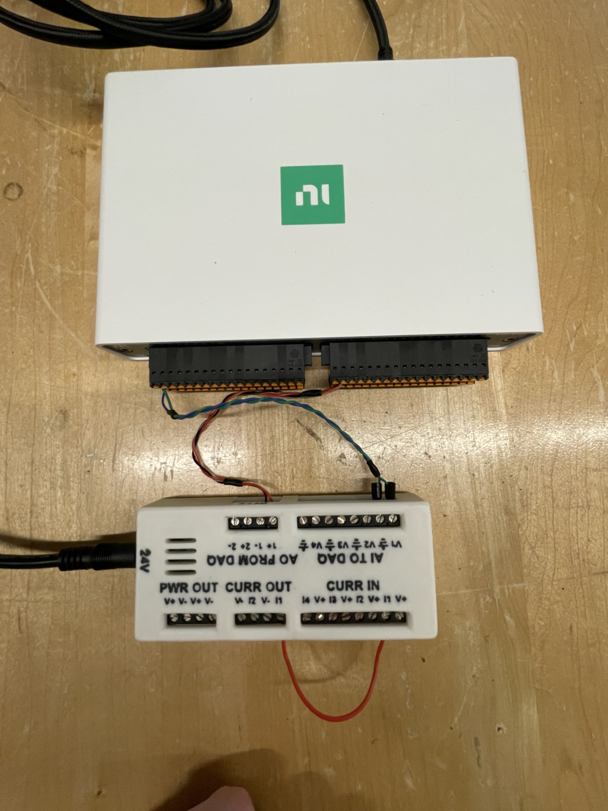
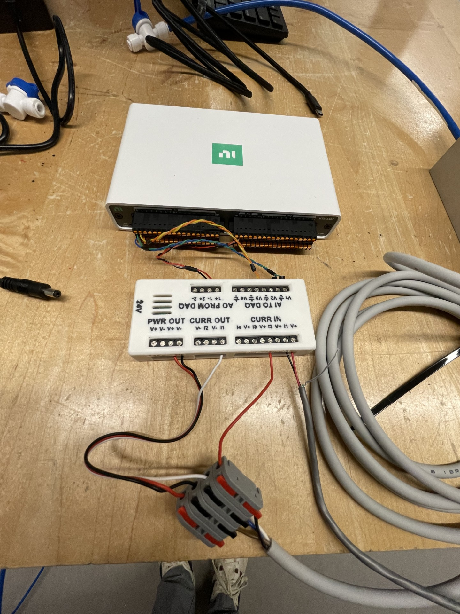
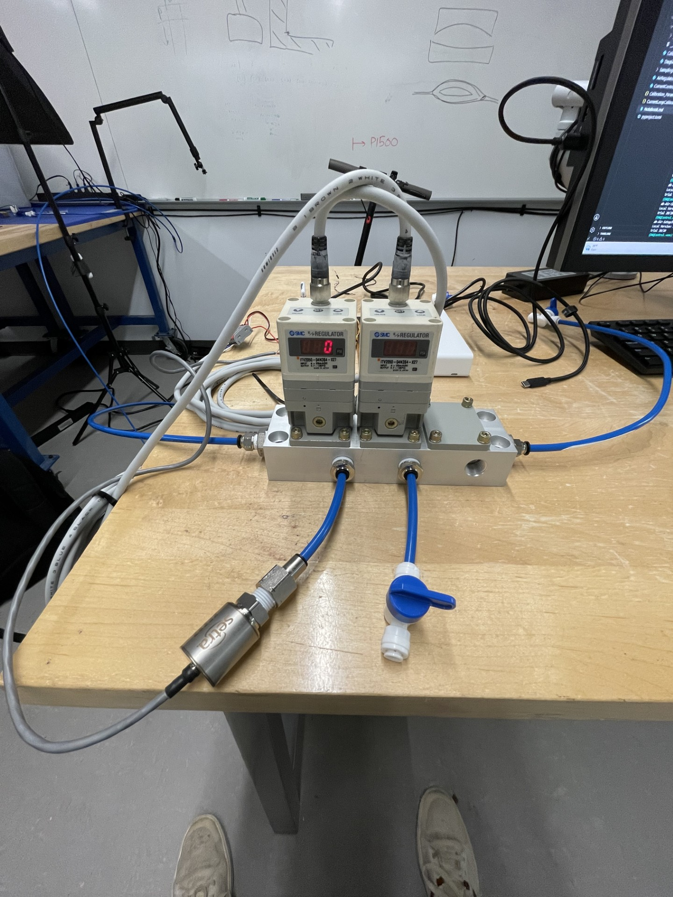
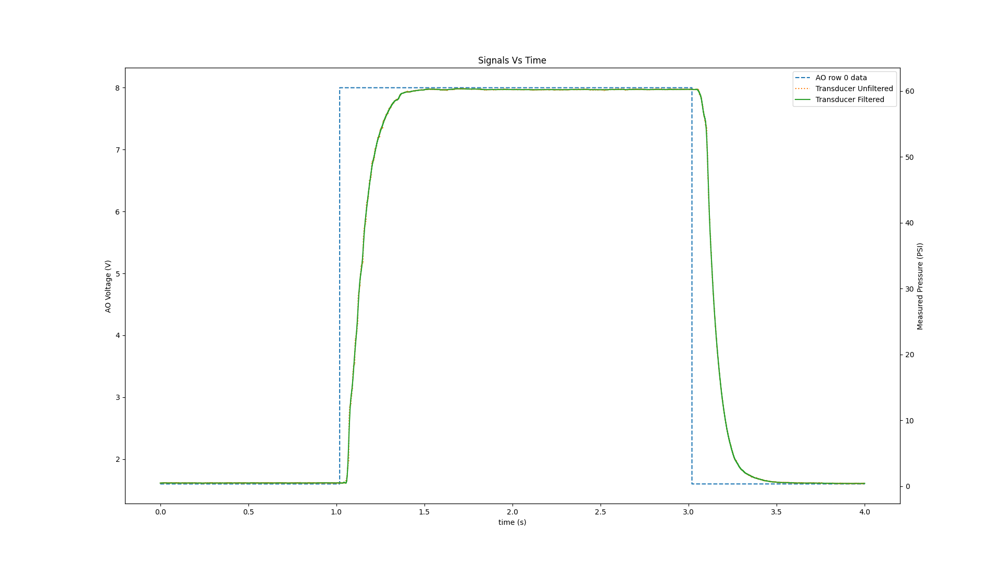
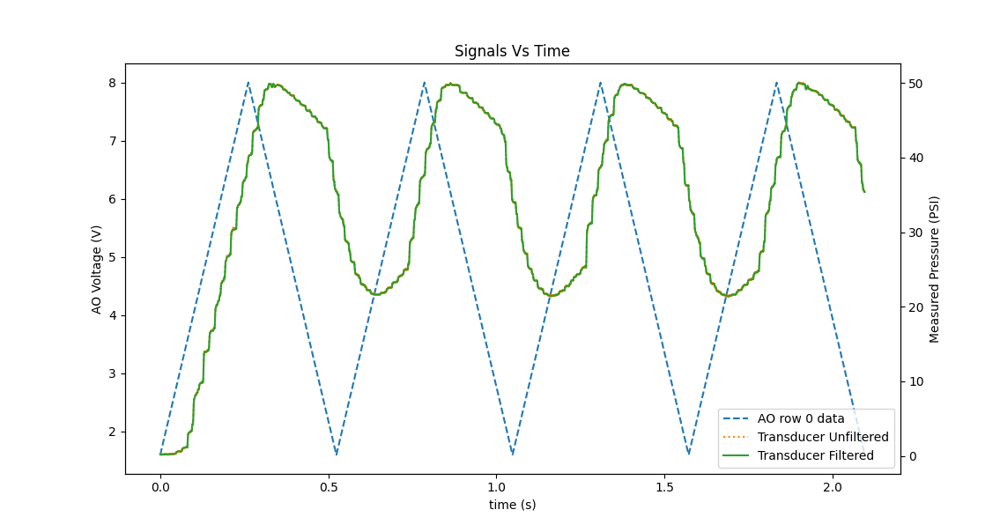
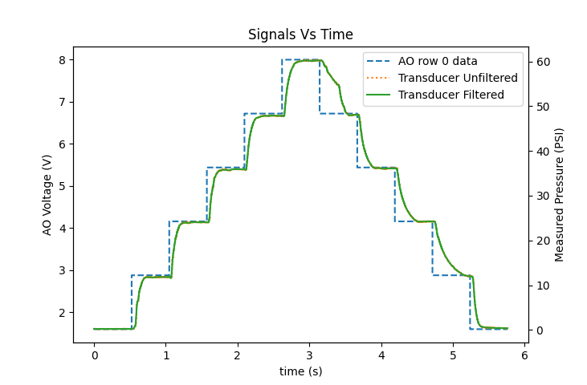
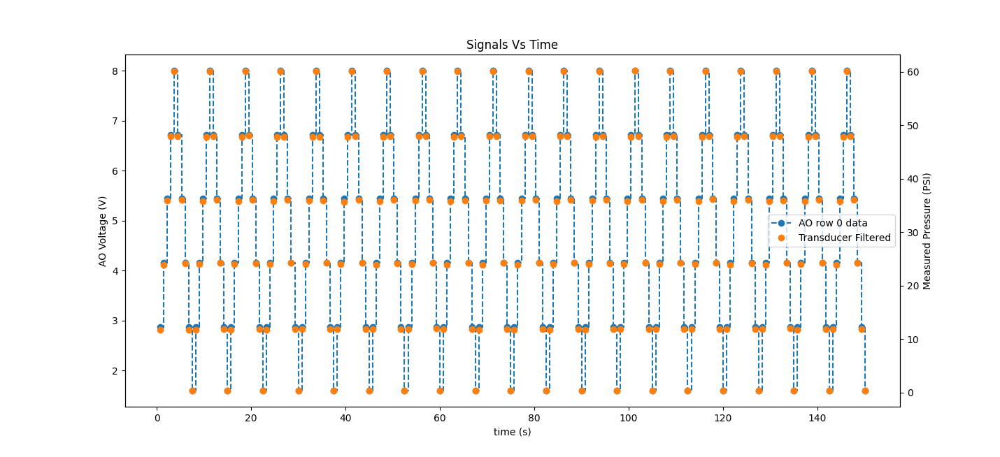
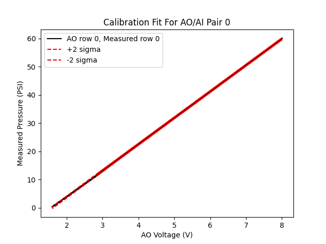

# Current Loop Controller Calibration
## Materials
- NI-DAQ USB-6421, S/N 283489E
- 24V Power supply, model LYD1302405000
- Lab custom current loop interface
- Two twisted pairs of 24 AWG wire ~150 mm long
- A strand of 22 AWG wire ~80 mm long

## Setup
Current loop channels 1 and 2 were calibrated independently of one another. I originally tried to calibrate them together, but found significant 'cross-talk' between the channels. It seems that due to the DAQ's common analog ground reference, the current return paths for each XTR116 module aren't independent and therefore output current isn't independent either. To calibrate channel 1 of the current loop interface, I made the following connections with twisted pairs (every 2 rows starting from the top is a twisted cable pair):
| NI-DAQ Port | Current Loop Interface Port |
|-------------|-----------------------------|
| AO0         | AO FROM DAQ: 1+             |
| Gnd         | AO FROM DAQ: 1-             |
| AI0         | AI TO DAQ: V1               |
| AI8         | AI TO DAQ: GND              |

- On the current loop interface, the Curr Out: I1 pin was connected to the Curr In: I1 pin via the 22 AWG wire strand
- The DAQ was connected to the lab computer via USB-C
- The 24V power supply was connected to the current loop interface via barrel jack.
 

Below is an image of the wiring setup for channel 1:

When testing channel 2, I moved the 22 AWG wire strand to connect the Curr Out: I2 pin to the Curr In: I1 pin and changed the twisted pair connections to:
| NI-DAQ Port | Current Loop Interface Port |
|-------------|-----------------------------|
| AO0         | AO FROM DAQ: 2+             |
| Gnd         | AO FROM DAQ: 2-             |
| AI0         | AI TO DAQ: V1               |
| AI8         | AI TO DAQ: GND              |

## Methods & Results
Within [CurrentControllerCalibration.py](src/CurrentControllerCalibration.py), I drove the current loop interface at increasing frequencies until significant deviation was detected on either current channel. In this way, I found a suitable frequency upper bound. This test was only done with channel 1, as the channels are expected to operate similarly enough for the upper bound to be shared between them. The following table shows tested frequencies and results:
| Frequency (kHz) | Notes                                                                                                                                                                                                                                                         |
|-----------------|---------------------------------------------------------------------------------------------------------------------------------------------------------------------------------------------------------------------------------------------------------------|
| 250             | 1 sample delay (~4 µs delay) between analog out and analog in signals. Keep in mind, the AI signal is already being shifted forward by 1 sample to account for the fact that AI samples before AO is finished setting, so this is effectively an ~8 µs delay. |
| 100             | No more delay, but there is still hysteresis in the signal                                                                                                                                                                                                    |
| 40              | No visible hysteresis                                             

 

With an upper bound of 40 kHz for sampling, I collected calibration data across a wide frequency spectrum with 20 trials per frequency, 5 wave periods per trial, and 200 samples per period. All data per frequency was lumped together to generate a linear regression fit to measured current in mA vs input voltage in V. The results are recorded in the following table:

| Frequency (kHz) | Channel 1 Slope | Channel 1 Standard error |
|-----------------|-----------------|--------------------------|
| 40              | 2.4995          | 2.324E-2                 |
| 10              | 2.4993          | 2.066E-2                 |
| 2.5             | 2.4992          | 1.983E-2                 |
| 0.625           | 2.4992          | 1.999E-2                 |
| 0.04            | 2.4992          | 2.044E-2                 |

 

While channel 1 error falls moving from 40 kHz to 10 kHz sampling frequency, there is not much change after that. I used a frequency of 2.5 kHz 20 trials, 5 wave periods per trial, and 200 samples per wave to obtain final values for calibration slope and offset for the current loop interface. Those values are stored in [Calibration_Params.json](Calibration_Params.json) and are reported here:

|                     | Channel 1 | Channel 2 |
|---------------------|-----------|-----------|
| Slope (mA / V)        | 2.499177  | 2.499259  |
| Interecept (mA)     | 7.2334E-3 | 8.4657E-3 |
| Standard Error (mA) | 2.088E-2  | 2.013E-2  |
| R Squared           | 0.99999   | 0.99999   |

 

# Electric Regulator Calibration
## Materials
- Two electronic pressure regulators, model ITV2050-04N3S4-X27
- A calibrated pressure transducer (100 PSI rating), P/N AXD1100PG2M1102FCN S/N 12688243
- NI-DAQ USB-6421, S/N 283489E
- 24V Power supply, model LYD1302405000
- Lab custom current loop interface
- Three twisted pairs of 24 AWG wire ~150 mm long

## Setup
The following connections were made with twisted pairs, where every 2 rows starting from the top is a twisted cable pair:
| NI-DAQ Port | Current Loop Interface Port |
|-------------|-----------------------------|
| AO0         | AO FROM DAQ: 1+             |
| Gnd         | AO FROM DAQ: 1-             |
| AI0         | AI TO DAQ: V1               |
| AI8         | AI TO DAQ: GND              |
| AI1         | AI TO DAQ: V2               |
| AI9         | AI TO DAQ: GND              |

 

The following connections were made between the regulator and the current loop interface:
| Regulator Wire | Current Loop Interface Port |
|----------------|-----------------------------|
| Brown          | PWR OUT: V+                 |
| Blue           | PWR OUT: V-                 |
| White          | CURR OUT: I1                |
| Black          | CURR IN: I2                 |

 

The following connections were made between the pressure tranducer and the current loop interface:
| Transducer Wire | Current Loop Interface Port |
|-----------------|-----------------------------|
| Red             | Curr IN: V+                 |
| Black           | Curr IN: I1                 |
| Shield          | AI TO DAQ: GND              |

- The DAQ was connected to the lab computer via USB-C
- The 24V power supply was connected to the current loop interface via barrel jack.
- The regulator manifold was connected to a line regulated to 80 PSI from the wall as read by the pressure indicator on the manual regulator
- The pressure transducer was connected directly to the regulator outlet by 1/4" OD tubing ~40 mm long
- All other outlets on the regulator manifold were plugged with 1/4" tubing connected to a closed valve

I assume a linear relationship from 0 to 100 PSI acting on the pressure transducer to 4 to 20 mA of output current, which is supported by its calibration data. The pressure transducer was directly connected to the output of the regulator, and the regulator manifold was supplied with a regulated 80 PSI from the wall.

The regulator's upper and lower pressure setpoints (F_1 and F_2 on the regulator display) were set to 0 and 60 psi respectively.

Below are images of the wiring setup and pneumatic setup for this calibration:

The above image does not show transucer shield wiring connected to GND or the 24V barrel jack connected to the current loop interface; both of these connections were made during testing.

## Methods & Results
We first opened the air regulator and oiled its upper and lower air driven valves, which were very sticky at first. We were only able to open regulator 2 due to a stripped screw in regulator 1, so the results presented here are only for regulator 2 unless otherwise stated.

I first wanted to test the transient response for these regulators, so I looked at the step response. To get the step response, I used a square wave from 4-20 mA with a period of 4s and 10k samples per period. The measured pressure data was noisy, so I applied a lowpass filter (`scipy.signal.butter`) with cutoff frequency of 40 Hz to eliminate most of the noise. The result of this step response is shown below:

 

Though uncalibrated, the pressure regulator did settle at 60 psi under 20 mA control current as expected, to within ~0.2 psi.

There is a delay of ~35 ms between when the control current changes and when the regulator begins to change its pressure on both rising and falling edges. This is likely not due to any transience on the current control side, as when calibrating the current controller it worked as expected well above 1 kHz.

I calculated 95% rise time both starting from the rising/falling edge of the control signal and starting from the first rising/falling data point in the transducer signal (unfiltered). Rising and falling points were detected 'by eye' on the graph. I considered the stable value to be 60.24 psi, putting the 95% settled value at 57.228 psi. The results are shown in the below table:

|                     | Channel 1 | Channel 2 |
|---------------------|-----------|-----------|
| Slope (mA/V)        | 2.499177  | 2.499259  |
| Interecept (mA)     | 7.2334E-3 | 8.4657E-3 |
| Standard Error (mA) | 2.088E-2  | 2.013E-2  |
| R Squared           | 0.99999   | 0.99999   |

 

While venting is faster than pressurizing, the difference between the two's performance (~15 ms) is much smaller than the overall time of ~250 ms. The large overall settling time also makes the  ~35 ms delay assumedly introduced by the regulator's controller less significant.

Assuming then that the regulator is rate-limited by airflow, the maximum response for this regulator with 80 psi inlet pressure and 60 psi commanded outlet pressure should be: 57.228 psi / 0.25 s or ~225 psi/s. In a triangle wave commanding 0 to 60 psi outlet pressure, this represents a wave period of: 2 * (60 psi / 225 psi/s) or ~0.524 s. I tested a triangle wave with these parameters (4 - 20 mA signal amplitude, 0.524 s wave period, 10k samples per wave); the results are shown below:

 

There is a substantial lag between control signal and the pressure signal. I measured these offsets at 6V AO Voltage and got: 63 ms on average and 184 ms on average for the rising edge and falling edge respectively.

The peak pressure achieved was ~50 psi—10 psi lower than the expected value. The minimum pressure achieved (ignoring the start) was ~21 psi.

Clearly, the maximum rate of pressure change calculated from the step response is not achievable as a continuously controlled ramp. To find the maximum controllable rate of pressure change, I slowly increased wave period until I saw good performance. While the delay significantly decreased with a relatively small increase in period (1 s period saw substantial improvement), the regulator still could not reach maximum or minimum pressure properly. I've recorded max and min pressures for several tested wave periods in the following table:

| Wave Period (s) | Max Pressure (psi) | Min Pressure (psi) |
|-----------------|--------------------|--------------------|
| 0.6             | 50.853             | 19.577             |
| 0.8             | 53.350             | 16.106             |
| 1.0             | 54.877             | 10.969             |
| 1.5             | 57.189             | 5.148              |
| 2.0             | 58.262             | 3.913              |
| 2.5             | 58.892             | 2.978              |
| 3.0             | 59.226             | 1.629              |
| 4.0             | 59.624             | 1.214              |
| 5.0             | 59.631             | 0.945              |
| 10.0            | 60.004             | 0.536              |

Across the range of frequencies tested the venting edge of the transducer signal consistently showed a change in slope from ~1/4 of the way down from max pressure. That combined with the very poor performance compared to the step test lead me to believe that maybe the regulator needs a settling time at each commanded pressure before new commands are given. To that end, I tried reducing the number of changes in the control waveform such that the regulator would again have ~0.524 s between updates in pressure:

 

Allowing the regulator to settle each step of the signal seems to work well. The 0.524 s settling time here is more than is needed as these jumps in pressure are smaller than the 0-60 psi step response T95% was measured from.

With this in mind, to get a calibration curve for true pressure (using the calibrated transducer as a source of truth) as a function of input voltage, I ran 40 trials using a signal with 10 samples per wave and a 7.5 s wave period. I used the filtered readings taken the sample before the control signal changed to get a calibration curve:

The fit parameters are again saved in the [Calibration_Params.json](Calibration_Params.json) file and are reported below:
- slope: 9.348368 psi / V
- intercept: -14.866592 psi
- standard error: 0.178 psi
- R squared: 0.99990

I can use the current control calibration to estimate what these parameters should be. When programmed with 0-60 psi limits, the regulator should output 0 psi at 4 mA input current and 60 psi at 20 mA imput current. This shakes out to a transfer function:
P = 3.750*I - 15.000

From the current loop interface calibration, I can substitute the conversion from volts to current:
I = 2.499*V - 0.007

Into the equation for pressure:
P = 9.372*V - 14.973

These values for slope and intercept are very close to the values determined experimentally, woo!